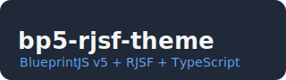

[](https://www.npmjs.com/package/@anikitenko/bp5-rjsf-theme)
[](https://www.npmjs.com/package/@anikitenko/bp5-rjsf-theme)
[](https://github.com/anikitenko/bp5-rjsf-theme/actions/workflows/release.yml)
[](https://github.com/anikitenko/bp5-rjsf-theme/actions/workflows/github-code-scanning/codeql)
[](LICENSE)

<p style="text-align: center">
  
</p>

# @anikitenko/bp5-rjsf-theme

> 💠 A fully TypeScript-compatible BlueprintJS v5 theme for [react-jsonschema-form (RJSF)](https://github.com/rjsf-team/react-jsonschema-form)

This is the **first and only** RJSF theme implementation built from the ground up for **BlueprintJS v5**, written entirely in **TypeScript**, and compiled in **strict mode** to ensure **full compatibility** with the RJSF Theme system.

---

## 🚧 Project Status

⚠️ This project is **still under active development**.  
🧪 **Examples and documentation are coming soon!**

---

## ✨ Features

- ✅ **Strictly typed**: Powered by TypeScript and validated against `ThemeProps`.
- ✅ **BlueprintJS v5-first**: Uses the latest Blueprint components for styling and behavior.
- ✅ **Plug-and-play** usage with `@rjsf/core`.

---

## 🧩 Implemented Widgets

| Widget                            | Status |
| --------------------------------- | ------ |
| `TextWidget`                      | ✅     |
| `UpDownWidget`                    | ✅     |
| `SelectWidget` with `MultiSelect` | ✅     |
| `CheckboxWidget`                  | ✅     |
| `CheckboxesWidget`                | ✅     |

---

## 🏗️ Implemented Templates

| Template                   | Status |
| -------------------------- | ------ |
| `ObjectFieldTemplate`      | ✅     |
| `FieldTemplate`            | ✅     |
| `ErrorListTemplate`        | ✅     |
| `ArrayFieldTemplate`       | ✅     |
| `SubmitButton`             | ✅     |
| `TitleFieldTemplate`       | ✅     |
| `DescriptionFieldTemplate` | ✅     |
| `WrapIfAdditionalTemplate` | ✅     |

---

## 🔧 Usage

Using this theme is as easy as:

```ts
import { withTheme } from "@rjsf/core";
import { Bp5Theme } from "@anikitenko/bp5-rjsf-theme";

const Form = withTheme(Bp5Theme);

// Then use it like any RJSF form
<Form schema={yourSchema} />
```

## 📦 Installation

```
npm install @anikitenko/bp5-rjsf-theme
# or
yarn add @anikitenko/bp5-rjsf-theme
```

## 🐞 Reporting Issues

If you find bugs or Blueprint components not rendering as expected:

- Please open an [issue on GitHub](https://github.com/anikitenko/bp5-rjsf-theme/issues)
- Include a minimal schema and usage snippet to help us debug quickly

## ❤️ Contributing

PRs are welcome! If you're using BlueprintJS v5 + RJSF and want to improve or extend this theme — fork away and submit a PR!

## 📘 License

MIT

> Made with 💙 by [@anikitenko](https://github.com/anikitenko)
